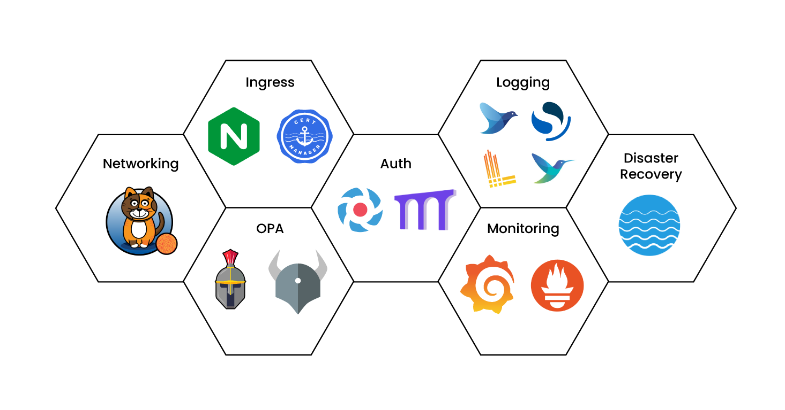

<h1 align="center">
  <br/>
  Kubernetes Fury Distribution
</h1>

<p align="center">Kubernetes Fury Distribution (KFD) is a certified battle-tested Kubernetes distribution based purely on upstream Kubernetes.</p>

[](http://ci.sighup.io/sighupio/fury-distribution)
[](https://github.com/sighupio/fury-distribution/releases/latest)
[](https://kubernetes.slack.com/archives/C0154HYTAQH)
[](https://github.com/sighupio/fury-distribution/blob/master/LICENSE)


## Overview

Kubernetes Fury Distribution (KFD) is a [CNCF certified](https://landscape.cncf.io/?selected=fury-distribution) battle-tested Kubernetes distribution based purely on upstream Kubernetes.

It is developed and maintained by [SIGHUP](https://sighup.io/) and the community, and it is fully open source.

> 🎯 The goal of Fury is to turn any standard Kubernetes cluster into a fully-configured production-grade cluster.

## Un-distribution model

KFD uses an **un-distribution model**. This means that we:

- Rely only on open source solutions.
- Are free from vendor lock-in.
- Stay close to upstream Kubernetes and the cloud native landscape.
- Choose and configure a set of battle-tested open source tools.

## Compatibility

| Kubernetes Version |   Compatibility    |                        Notes                        |
| ------------------ | :----------------: | --------------------------------------------------- |
| `1.20.x`           | :white_check_mark: | No known issues                                     |
| `1.21.x`           | :white_check_mark: | No known issues                                     |
| `1.22.x`           | :white_check_mark: | No known issues                                     |
| `1.23.x`           |     :warning:      | Tech Preview, not officially supported by SIGHUP    |

Check the [compatibility matrix][compatibility-matrix] for the complete compatibility list of the previous releases of
the distribution.

## Architecture

Kubernetes Fury Distribution is structured on modules, and each module has a set of packages.

- A package is a single unit of functionality.
- A module groups together packages that are functionally related.

> All modules are open source, widely used, easily customizable, and pre-configured with sane defaults.

The standard way to deploy KFD is to:

- Deploy all the [Core Modules](#core-modules) of the distribution
- Deploy (if needed) any of the [Addon modules](#addon-modules)

### Core Modules

Core modules provides essential functionality to the distribution.

<p align="center">
  
</p>

|             Module              |         Included Release       |                                        Description                                        |
| ------------------------------- | ------------------------------ | ----------------------------------------------------------------------------------------- |
| [Networking][networking-module] | ![Version][networking-version] | Networking functionality via Calico CNI                                                   |
| [Ingress][ingress-module]       | ![Version][ingress-version]    | Fast and reliable Ingress Controller and TLS certificate management                       |
| [Logging][logging-module]       | ![Version][logging-version]    | A centralized logging solution based on the EFK stack (Elastic, Fluentd and Kibana)        |
| [Monitoring][monitoring-module] | ![Version][monitoring-version] | Monitoring and alerting functionality based on Prometheus, AlertManager and Grafana       |
| [Disaster Recovery][dr-module]  | ![Version][dr-version]         | Backup and disaster recovery solution using Velero                                        |
| [OPA][opa-module]               | ![Version][opa-version]        | Policy and Governance for your cluster using OPA Gatekeeper and Gatekeeper Policy Manager |

### Add-on Modules

Add-on modules provides additional functionality to the distribution.

|               Module                |          Latest Release          |                                 Description                                  |
| ----------------------------------- | -------------------------------- | ---------------------------------------------------------------------------- |
| [Kong][kong-module]                 | ![Version][kong-version]         | Add Kong API Gateway for Kubernetes applications via Kong Ingress Controller |
| [Service Mesh][service-mesh-module] | ![Version][service-mesh-version] | Deploy a service mesh on top of KFD                                          |
| [Registry][registry-module]         | ![Version][registry-version]     | Integrate a Container Registry solution                                      |


## Get started with KFD

To download the distribution, you will need our [furyctl][furyctl] tool.

Download the latest version with:

```bash
furyctl distribution template --version v1.23.1
```

It will download the release `v1.23.1` of the `Furyfile.yml` and a `kustomization.yaml` file to your current directory.

Download all the modules with:

```bash
furyctl distribution download
```

Additionally, more comprehensive examples of the KFD can be found on our [documentation site](https://docs.kubernetesfury.com/docs/distribution/#%EF%B8%8F-how-do-i-get-started).

## Issues

In case you experience any issues feel free to [open a new issue](https://github.com/sighupio/fury-distribution/issues/new/choose).

If  the problem is related to a specific module, open the issue in the module repository.

## Contributing

If you wish to contribute please read the [Contributing Guidelines](docs/CONTRIBUTING.md).

## CNCF Certified 🎓

Kubernetes Fury Distribution has been certified by the [CNCF] *(Cloud Native Computing foundation)* as a *Certified Kubernetes Distribution*. Certified solutions are validated to ensure a set of guarantees as consistency, timely updates and confirmability.

<center>
    <a href="https://github.com/cncf/k8s-conformance/pull/1280">
        
    </a>
    <a href="https://github.com/cncf/k8s-conformance/pull/1495">
        
    </a>
    <a href="https://github.com/cncf/k8s-conformance/pull/1602">
        
    </a>
    <a href="https://github.com/cncf/k8s-conformance/pull/1788">
        
    </a>
</center>

## License

KFD is open-source software and it's released under the following [LICENSE](LICENSE)

<!-- Core Modules -->
[networking-module]: https://github.com/sighupio/fury-kubernetes-networking
[ingress-module]: https://github.com/sighupio/fury-kubernetes-ingress
[logging-module]: https://github.com/sighupio/fury-kubernetes-logging
[monitoring-module]: https://github.com/sighupio/fury-kubernetes-monitoring
[dr-module]: https://github.com/sighupio/fury-kubernetes-dr
[opa-module]: https://github.com/sighupio/fury-kubernetes-opa

[networking-version]: https://img.shields.io/badge/release-v1.8.2-blue
[ingress-version]: https://img.shields.io/badge/release-v1.12.2-blue
[logging-version]: https://img.shields.io/badge/release-v1.10.2-blue
[monitoring-version]: https://img.shields.io/badge/release-v1.14.1-blue
[dr-version]: https://img.shields.io/badge/release-v1.9.2-blue
[opa-version]: https://img.shields.io/badge/release-v1.6.2-blue

<!-- Addon Modules -->
[kong-module]: https://github.com/sighupio/fury-kubernetes-kong
[service-mesh-module]: https://github.com/sighupio/fury-kubernetes-service-mesh
[registry-module]: https://github.com/sighupio/fury-kubernetes-registry

[kong-version]: https://img.shields.io/github/v/release/sighupio/fury-kubernetes-kong
[service-mesh-version]: https://img.shields.io/github/v/release/sighupio/fury-kubernetes-service-mesh
[registry-version]: https://img.shields.io/github/v/release/sighupio/fury-kubernetes-registry

<!-- Misc -->
[CNCF]: https://landscape.cncf.io/card-mode?category=certified-kubernetes-distribution&grouping=category&organization=sighup
[compatibility-matrix]: https://github.com/sighupio/fury-distribution/blob/master/docs/COMPATIBILITY_MATRIX.md
[furyctl]: https://github.com/sighupio/furyctl
