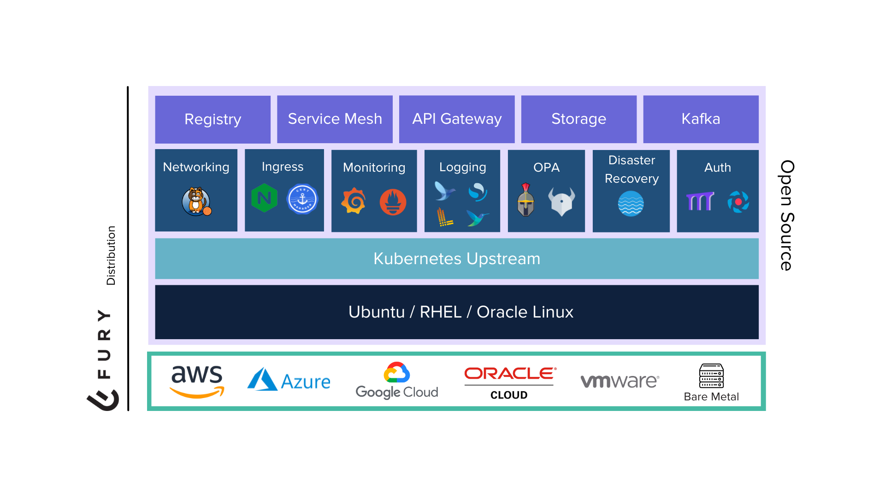

<!-- markdownlint-disable MD033 -->
<h1 align="center">
   
  Kubernetes Fury Distribution
</h1>

Kubernetes Fury Distribution (KFD) is a certified battle-tested Kubernetes distribution based purely on upstream Kubernetes.

<!-- markdownlint-enable MD033 -->

## Overview

Kubernetes Fury Distribution (KFD) is a [CNCF certified](https://landscape.cncf.io/?selected=fury-distribution) battle-tested Kubernetes distribution based purely on upstream Kubernetes.

It is developed and maintained by [SIGHUP][sighup-site] and the community, and it is fully open source.

> 🎯 The goal of Fury is to turn any standard Kubernetes cluster into a fully-configured production-grade cluster.

## Un-distribution model 🧬

KFD uses an **un-distribution model**. This means that we:

- Rely only on open source solutions.
- Are free from vendor lock-in.
- Stay close to upstream Kubernetes and the cloud native landscape.
- Choose and configure a set of battle-tested open source tools.

## Architecture 🏗

<!-- markdownlint-disable MD033 -->

  

<!-- markdownlint-enable MD033 -->

Kubernetes Fury Distribution is structured on modules, and each module has a set of packages.

- A package is a single unit of functionality.
- A module groups packages that are functionally related together.

> All modules are open source, widely used, easily customizable, and pre-configured with sane defaults and tested to work well together.

The standard way to deploy KFD is to:

- Deploy all the [Core Modules](#core-modules-) of the distribution
- Deploy (if needed) any of the [Addon modules](#add-on-modules-)

### Core Modules 📦

Core modules provide essential functionality to the distribution for production-grade clusters.

| Module                          | Included Release               | Description                                                                               |
| ------------------------------- | ------------------------------ | ----------------------------------------------------------------------------------------- |
| [Networking][networking-module] | ![Version][networking-version] | Networking functionality via Calico CNI                                                   |
| [Ingress][ingress-module]       | ![Version][ingress-version]    | Fast and reliable Ingress Controller and TLS certificate management                       |
| [Logging][logging-module]       | ![Version][logging-version]    | A centralized logging solution based on the OpenSearch stack                              |
| [Monitoring][monitoring-module] | ![Version][monitoring-version] | Monitoring and alerting functionality based on Prometheus, AlertManager and Grafana       |
| [Monitoring][tracing-module] | ![Version][tracing-version] | Tracing functionality based on Tempo |
| [Disaster Recovery][dr-module]  | ![Version][dr-version]         | Backup and disaster recovery solution using Velero                                        |
| [OPA][opa-module]               | ![Version][opa-version]        | Policy and Governance for your cluster using OPA Gatekeeper and Gatekeeper Policy Manager |
| [Auth][auth-module]             | ![Version][auth-version]       | Improved auth for your Kubernetes Cluster and its applications                            |

### Add-on Modules 📦

Add-on modules provide additional functionality to the distribution. Their release cycle is independent of KFD's.

| Module                              | Latest Release                   | Description                                                                  |
| ----------------------------------- | -------------------------------- | ---------------------------------------------------------------------------- |
| [Kong][kong-module]                 | ![Version][kong-version]         | Add Kong API Gateway for Kubernetes applications via Kong Ingress Controller |
| [Service Mesh][service-mesh-module] | ![Version][service-mesh-version] | Deploy a service mesh on top of KFD                                          |
| [Registry][registry-module]         | ![Version][registry-version]     | Integrate a Container Registry solution                                      |
| [Storage][storage-module]           | ![Version][storage-version]      | Rook (Ceph Operator) based Storage solution on Kubernetes                    |
| [Kafka][kafka-module]               | ![Version][kafka-version]        | Apache Kafka event streaming for your Cluster                                |

## Get started with KFD 🚀

To get started with KFD, please head to the [quickstart guides on the documentation site](https://docs.kubernetesfury.com/docs/distribution/#%EF%B8%8F-how-do-i-get-started).

## Issues 🐛

In case you experience any issues feel free to [open a new issue](https://github.com/sighupio/fury-distribution/issues/new/choose).

If the problem is related to a specific module, open the issue in the module repository.

## Commercial Support 🛟

If you are looking to run KFD in production and would like to learn more, SIGHUP (the company behind the Fury ecosystem) can help. Feel free to [email us](mailto:sales@sighup.io) or check out [our website](https://sighup.io).

## Support & Compatibility 🪢

Current supported versions of KFD are:

|                                  KFD Version                                   | Kubernetes Version |
| :----------------------------------------------------------------------------: | :----------------: |
| [`1.26.4`](https://github.com/sighupio/fury-distribution/releases/tag/v1.26.4) |      `1.26.x`      |
| [`1.25.9`](https://github.com/sighupio/fury-distribution/releases/tag/v1.25.9) |      `1.25.x`      |
| [`1.24.1`](https://github.com/sighupio/fury-distribution/releases/tag/v1.24.1) |      `1.24.x`      |

Check the [compatibility matrix][compatibility-matrix] for additional information about previous releases of the Distribution and the compatibility with `furyctl`.

Also, check the [versioning documentation file][versioning] to know more about the versioning scheme of the distribution and the upgrade path.

## CNCF Certified 🎓

Each version of the Kubernetes Fury Distribution that introduces compatibility with a new version of Kubernetes goes through a [conformance certification process with the CNCF][cncf-conformance]. Certified solutions are validated to ensure a set of guarantees such as consistency, timely updates and confirmability.

KFD has been certified by the [CNCF] (Cloud Native Computing Foundation) as a *Certified Kubernetes Distribution* for all Kubernetes versions since [Kubernetes 1.12](https://github.com/cncf/k8s-conformance/pull/619). Clicking on the badge below you can see the certification process for the latest version of KFD:

<!-- markdownlint-disable MD033 -->

    

<!-- markdownlint-enable MD033 -->

## Contributing 🤝

If you wish to contribute please read the [Contributing Guidelines](docs/CONTRIBUTING.md).

## License

KFD is open-source software and it's released under the following [LICENSE](LICENSE)

<!-- Core Modules -->
[networking-module]: https://github.com/sighupio/fury-kubernetes-networking
[ingress-module]: https://github.com/sighupio/fury-kubernetes-ingress
[logging-module]: https://github.com/sighupio/fury-kubernetes-logging
[monitoring-module]: https://github.com/sighupio/fury-kubernetes-monitoring
[tracing-module]: https://github.com/sighupio/fury-kubernetes-tracing
[dr-module]: https://github.com/sighupio/fury-kubernetes-dr
[opa-module]: https://github.com/sighupio/fury-kubernetes-opa
[auth-module]: https://github.com/sighupio/fury-kubernetes-auth

[networking-version]: https://img.shields.io/badge/release-v1.14.0-blue
[ingress-version]: https://img.shields.io/badge/release-v2.2.0-blue
[logging-version]: https://img.shields.io/badge/release-v3.3.0-blue
[monitoring-version]: https://img.shields.io/badge/release-v3.0.1-blue
[tracing-version]: https://img.shields.io/badge/release-v1.0.0-blue
[dr-version]: https://img.shields.io/badge/release-v2.2.0-blue
[opa-version]: https://img.shields.io/badge/release-v1.11.0-blue
[auth-version]: https://img.shields.io/badge/release-v0.1.0-blue

<!-- Addon Modules -->
[kong-module]: https://github.com/sighupio/fury-kubernetes-kong
[service-mesh-module]: https://github.com/sighupio/fury-kubernetes-service-mesh
[registry-module]: https://github.com/sighupio/fury-kubernetes-registry
[storage-module]: https://github.com/sighupio/fury-kubernetes-storage
[kafka-module]: https://github.com/sighupio/fury-kubernetes-kafka

[kong-version]: https://img.shields.io/github/v/release/sighupio/fury-kubernetes-kong
[service-mesh-version]: https://img.shields.io/github/v/release/sighupio/fury-kubernetes-service-mesh
[registry-version]: https://img.shields.io/github/v/release/sighupio/fury-kubernetes-registry
[storage-version]: https://img.shields.io/github/v/release/sighupio/fury-kubernetes-storage
[kafka-version]: https://img.shields.io/github/v/release/sighupio/fury-kubernetes-kafka

[compatibility-matrix]: https://github.com/sighupio/fury-distribution/blob/main/docs/COMPATIBILITY_MATRIX.md
[versioning]: https://github.com/sighupio/fury-distribution/blob/main/docs/VERSIONING.md

<!-- Misc -->
[sighup-site]: https://sighup.io
[CNCF]: https://landscape.cncf.io/card-mode?category=certified-kubernetes-distribution&grouping=category&organization=sighup
[cncf-conformance]: https://www.cncf.io/certification/software-conformance/
