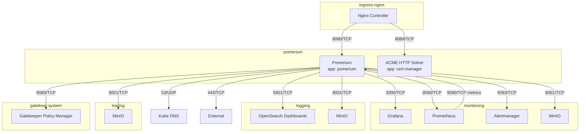

# SSO with Pomerium

```mermaid
graph TD
    %% Namespaces
    subgraph ingress-nginx
        nginx[Nginx Controller]
    end

    subgraph pomerium
        pom[Pomerium<br/>app: pomerium]
        acme[ACME HTTP Solver<br/>app: cert-manager]
    end

    subgraph monitoring
        graf[Grafana]
        prom[Prometheus]
        am[Alertmanager]
        minio_monitoring[MinIO]
    end

    subgraph logging
        osd[OpenSearch Dashboards]
        minio_logging[MinIO]
    end

    subgraph tracing
        minio_tracing[MinIO]
    end

    subgraph gatekeer-system
        gpm[Gatekeeper Policy Manager]
    end

    %% External and K8s Core Components
    dns[Kube DNS]
    ext[External]

    %% Edges
    pom -->|"53/UDP"| dns
    nginx -->|"8080/TCP"| pom
    nginx -->|"8089/TCP"| acme
    prom -->|"9090/TCP metrics"| pom
    pom -->|"443/TCP"| ext
    pom -->|"3000/TCP"| graf
    pom -->|"9090/TCP"| prom
    pom -->|"9093/TCP"| am
    pom -->|"5601/TCP"| osd
    pom -->|"9001/TCP"| minio_logging
    pom -->|"9001/TCP"| minio_tracing
    pom -->|"9001/TCP"| minio_monitoring
    pom -->|"8080/TCP"| gpm
```