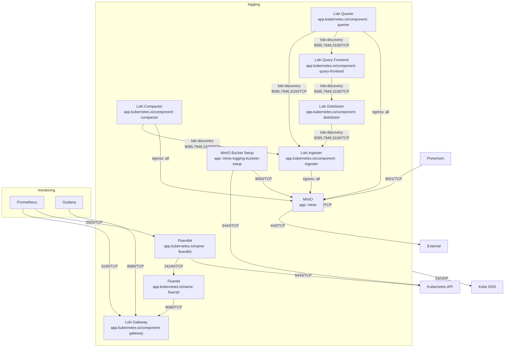

# Loki Stack Configuration

```mermaid
graph TD
    %% Namespaces
    subgraph logging
        fb[Fluentbit<br/>app.kubernetes.io/name: fluentbit]
        fd[Fluentd<br/>app.kubernetes.io/name: fluentd]
        loki_gateway[Loki Gateway<br/>app.kubernetes.io/component: gateway]
        loki_compactor[Loki Compactor<br/>app.kubernetes.io/component: compactor]
        loki_distributor[Loki Distributor<br/>app.kubernetes.io/component: distributor]
        loki_ingester[Loki Ingester<br/>app.kubernetes.io/component: ingester]
        loki_querier[Loki Querier<br/>app.kubernetes.io/component: querier]
        loki_query_frontend[Loki Query Frontend<br/>app.kubernetes.io/component: query-frontend]
        minio[MinIO<br/>app: minio]
        bucket[MinIO Bucket Setup<br/>app: minio-logging-buckets-setup]
    end

    subgraph monitoring
        prom[Prometheus]
        graf[Grafana]
    end

    pom[Pomerium]

    %% External and K8s Core Components
    api[Kubernetes API]
    ext[External]
    dns[Kube DNS]

    %% Edges
    logging -->|"53/UDP"| dns
    bucket -->|"6443/TCP"| api
    fb -->|"24240/TCP"| fd
    fd -->|"8080/TCP"| loki_gateway
    prom -->|"3100/TCP"| loki_gateway
    graf -->|"8080/TCP"| loki_gateway
    prom -->|"2020/TCP"| fb
    fb -->|"6443/TCP"| api 
    loki_query_frontend -->|"loki-discovery<br/>9095,7946,3100/TCP"| loki_distributor
    loki_distributor -->|"loki-discovery<br/>9095,7946,3100/TCP"| loki_ingester
    loki_querier -->|"loki-discovery<br/>9095,7946,3100/TCP"| loki_ingester
    loki_querier -->|"loki-discovery<br/>9095,7946,3100/TCP"| loki_query_frontend
    loki_compactor -->|"loki-discovery<br/>9095,7946,3100/TCP"| loki_ingester
    loki_compactor -->|"egress: all"| minio
    loki_ingester -->|"egress: all"| minio
    loki_querier -->|"egress: all"| minio
    bucket -->|"9000/TCP"| minio
    minio -->|"443/TCP"| ext
    pom -->|"9001/TCP"| minio
    minio -->|"9000/TCP"| logging
```