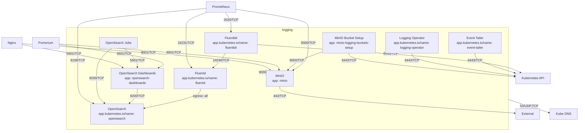

# Opensearch Stack Configuration

```mermaid
graph TD
    %% Namespace
    subgraph logging
        fb[Fluentbit<br/>app.kubernetes.io/name: fluentbit]
        fd[Fluentd<br/>app.kubernetes.io/name: fluentd]
        os[OpenSearch<br/>app.kubernetes.io/name: opensearch]
        osd[OpenSearch Dashboards<br/>app: opensearch-dashboards]
        minio[MinIO<br/>app: minio]
        bucket[MinIO Bucket Setup<br/>app: minio-logging-buckets-setup]
        op[Logging Operator<br/>app.kubernetes.io/name: logging-operator]
        et[Event Tailer<br/>app.kubernetes.io/name: event-tailer]
        job[OpenSearch Jobs]
    end

    %% External and K8s Core Components
    api[Kubernetes API]
    ext[External]
    prom[Prometheus]
    pom[Pomerium]
    nginx[Nginx]
    dns[Kube DNS]

    %% Edges
    logging --->|"53/UDP,TCP"| dns
    fb -->|"6443/TCP"| api
    et -->|"6443/TCP"| api
    op -->|"6443/TCP"| api
    bucket -->|"6443/TCP"| api
    fb -->|"24240/TCP"| fd
    fd -->|"egress: all"| os
    osd -->|"9200/TCP"| os
    pom -->|"5601/TCP"| osd
    job -->|"5601/TCP"| osd
    job -->|"9200/TCP"| os
    prom -->|"2020/TCP"| fb
    prom -->|"24231/TCP"| fd
    prom -->|"9108/TCP"| os
    prom -->|"9000/TCP"| minio
    bucket -->|"9000/TCP"| minio
    minio -->|"443/TCP"| ext
    pom -->|"9001/TCP"| minio
    logging -->|"9000/TCP"| minio
    nginx -->|"9001/TCP"| minio
    nginx -->|"5601/TCP"| osd
```