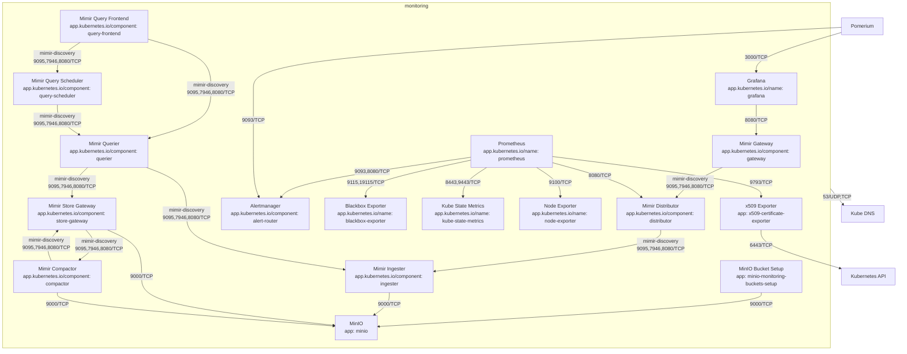

# Mimir Stack Configuration

```mermaid
graph TD
   %% Namespace
   subgraph monitoring
       gateway[Mimir Gateway<br/>app.kubernetes.io/component: gateway]
       distributor[Mimir Distributor<br/>app.kubernetes.io/component: distributor]
       ingester[Mimir Ingester<br/>app.kubernetes.io/component: ingester]
       querier[Mimir Querier<br/>app.kubernetes.io/component: querier]
       qfront[Mimir Query Frontend<br/>app.kubernetes.io/component: query-frontend]
       qsched[Mimir Query Scheduler<br/>app.kubernetes.io/component: query-scheduler]
       store[Mimir Store Gateway<br/>app.kubernetes.io/component: store-gateway]
       compactor[Mimir Compactor<br/>app.kubernetes.io/component: compactor]
       grafana[Grafana<br/>app.kubernetes.io/name: grafana]
       prom[Prometheus<br/>app.kubernetes.io/name: prometheus]
       am[Alertmanager<br/>app.kubernetes.io/component: alert-router]
       bb[Blackbox Exporter<br/>app.kubernetes.io/name: blackbox-exporter]
       ksm[Kube State Metrics<br/>app.kubernetes.io/name: kube-state-metrics]
       ne[Node Exporter<br/>app.kubernetes.io/name: node-exporter]
       x509[x509 Exporter<br/>app: x509-certificate-exporter]
       minio[MinIO<br/>app: minio]
       bucket[MinIO Bucket Setup<br/>app: minio-monitoring-buckets-setup]
   end

   %% External and K8s Core Components
   api[Kubernetes API]
   dns[Kube DNS]

   %% Edges
   monitoring -->|"53/UDP,TCP"| dns
   bucket -->|"9000/TCP"| minio
   qfront -->|"mimir-discovery<br/>9095,7946,8080/TCP"| qsched
   qfront -->|"mimir-discovery<br/>9095,7946,8080/TCP"| querier
   gateway -->|"mimir-discovery<br/>9095,7946,8080/TCP"| distributor
   distributor -->|"mimir-discovery<br/>9095,7946,8080/TCP"| ingester
   qsched -->|"mimir-discovery<br/>9095,7946,8080/TCP"| querier
   querier -->|"mimir-discovery<br/>9095,7946,8080/TCP"| store
   querier -->|"mimir-discovery<br/>9095,7946,8080/TCP"| ingester
   store -->|"mimir-discovery<br/>9095,7946,8080/TCP"| compactor
   compactor -->|"mimir-discovery<br/>9095,7946,8080/TCP"| store
   ingester & store & compactor -->|"9000/TCP"| minio
   grafana -->|"8080/TCP"| gateway
   prom -->|"8080/TCP"| distributor
   prom -->|"9115,19115/TCP"| bb
   prom -->|"8443,9443/TCP"| ksm
   prom -->|"9100/TCP"| ne
   prom -->|"9793/TCP"| x509
   prom -->|"9093,8080/TCP"| am
   pom[Pomerium] -->|"3000/TCP"| grafana
   pom -->|"9093/TCP"| am
   x509 -->|"6443/TCP"| api
```