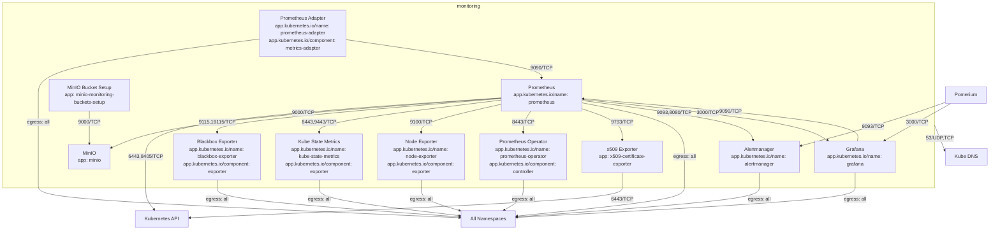

# Prometheus Stack Configuration

```mermaid
graph TD
    %% Namespace
    subgraph monitoring
        prom[Prometheus<br/>app.kubernetes.io/name: prometheus]
        grafana[Grafana<br/>app.kubernetes.io/name: grafana]
        am[Alertmanager<br/>app.kubernetes.io/name: alertmanager]
        bb[Blackbox Exporter<br/>app.kubernetes.io/name: blackbox-exporter<br/>app.kubernetes.io/component: exporter]
        ksm[Kube State Metrics<br/>app.kubernetes.io/name: kube-state-metrics<br/>app.kubernetes.io/component: exporter]
        ne[Node Exporter<br/>app.kubernetes.io/name: node-exporter<br/>app.kubernetes.io/component: exporter]
        pa[Prometheus Adapter<br/>app.kubernetes.io/name: prometheus-adapter<br/>app.kubernetes.io/component: metrics-adapter]
        po[Prometheus Operator<br/>app.kubernetes.io/name: prometheus-operator<br/>app.kubernetes.io/component: controller]
        minio[MinIO<br/>app: minio]
        bucket[MinIO Bucket Setup<br/>app: minio-monitoring-buckets-setup]
        x509[x509 Exporter<br/>app: x509-certificate-exporter]
    end

    %% External and K8s Core Components
    api[Kubernetes API]
    dns[Kube DNS]
    pom["Pomerium"]

    %% Edges
    monitoring -->|"53/UDP,TCP"| dns
    bucket -->|"9000/TCP"| minio
    prom -->|"6443,8405/TCP"| api
    prom -->|"9000/TCP"| minio
    prom -->|"9115,19115/TCP"| bb
    prom -->|"8443,9443/TCP"| ksm
    prom -->|"9100/TCP"| ne
    prom -->|"8443/TCP"| po
    prom -->|"9793/TCP"| x509
    prom & am & bb & grafana & ksm & ne & pa & po -->|"egress: all"| all[All Namespaces]
    pa -->|"9090/TCP"| prom
    grafana -->|"9090/TCP"| prom
    prom -->|"9093,8080/TCP"| am
    pom -->|"9093/TCP"| am
    prom -->|"3000/TCP"| grafana
    pom -->|"3000/TCP"| grafana
    x509 -->|"6443/TCP"| api
```
