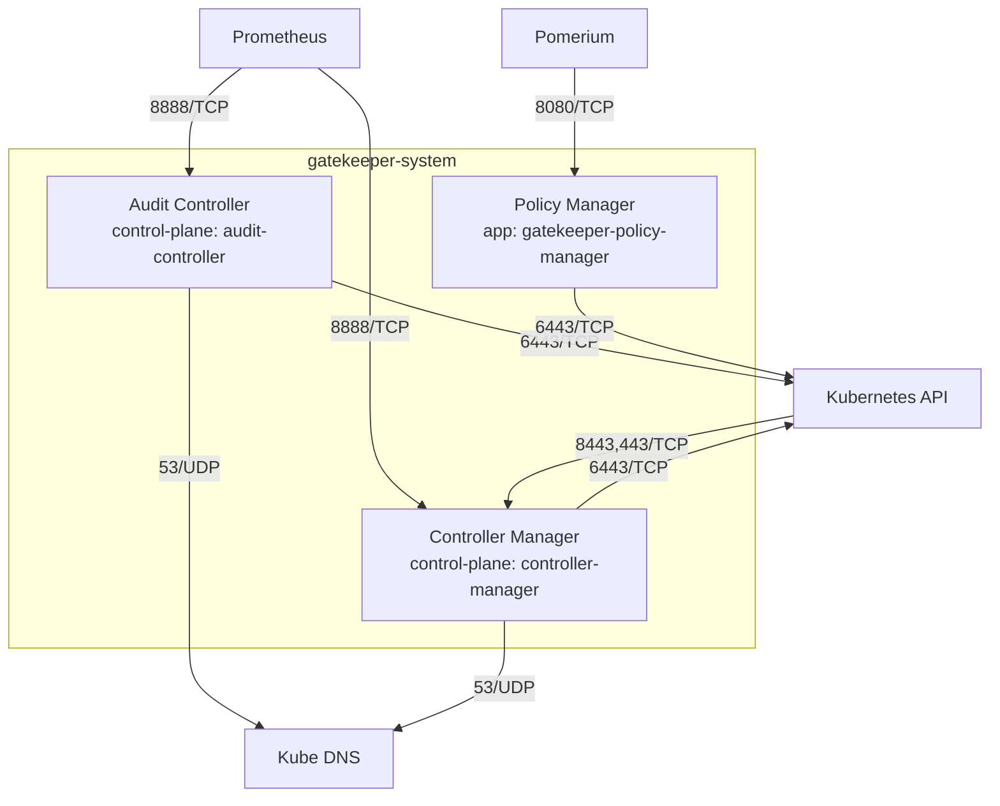

# Gatekeeper Configuration

```mermaid
graph TD
    %% Namespace
    subgraph gatekeeper-system
        audit[Audit Controller<br/>control-plane: audit-controller]
        cm[Controller Manager<br/>control-plane: controller-manager]
        gpm[Policy Manager<br/>app: gatekeeper-policy-manager]
    end

    %% External and K8s Core Components
    api[Kubernetes API]
    dns[Kube DNS]
    prom[Prometheus]
    pom[Pomerium]

    %% Edges
    audit & cm -->|"53/UDP"| dns
    audit -->|"6443/TCP"| api
    cm -->|"6443/TCP"| api
    gpm -->|"6443/TCP"| api
    pom -->|"8080/TCP"| gpm
    prom -->|"8888/TCP"| audit & cm
    api -->|"8443,443/TCP"| cm
```
