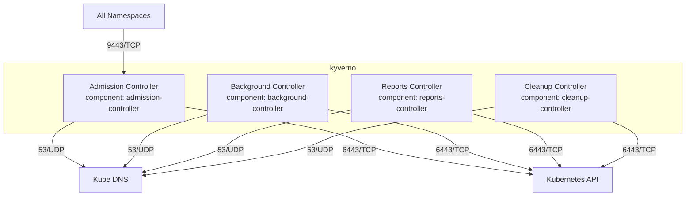

# Kyverno Configuration

```mermaid
graph TD
    %% Namespace
    subgraph kyverno
        admission[Admission Controller<br/>component: admission-controller]
        background[Background Controller<br/>component: background-controller]
        reports[Reports Controller<br/>component: reports-controller]
        cleanup[Cleanup Controller<br/>component: cleanup-controller]
    end

    %% External and K8s Core Components
    dns[Kube DNS]
    api[Kubernetes API]

    %% Edges
    admission -->|"53/UDP"| dns
    background -->|"53/UDP"| dns
    reports -->|"53/UDP"| dns
    cleanup -->|"53/UDP"| dns
    admission -->|"6443/TCP"| api
    background -->|"6443/TCP"| api
    reports -->|"6443/TCP"| api
    cleanup -->|"6443/TCP"| api
    all[All Namespaces] -->|"9443/TCP"| admission
```
