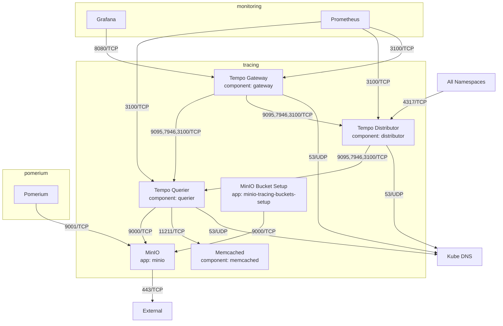

# Tempo Configuration

```mermaid
graph TD
    %% Namespaces
    subgraph tracing
        gateway[Tempo Gateway<br/>component: gateway]
        dist[Tempo Distributor<br/>component: distributor]
        query[Tempo Querier<br/>component: querier]
        mem[Memcached<br/>component: memcached]
        minio[MinIO<br/>app: minio]
        bucket[MinIO Bucket Setup<br/>app: minio-tracing-buckets-setup]
    end

    subgraph monitoring
        graf[Grafana]
        prom[Prometheus]
    end

    subgraph pomerium
        pom[Pomerium]
    end

    allns[All Namespaces]

    %% External and K8s Core Components
    dns[Kube DNS]
    ext[External]

    %% Edges
    gateway & dist & query -->|"53/UDP"| dns
    gateway -->|"9095,7946,3100/TCP"| dist & query
    dist -->|"9095,7946,3100/TCP"| query
    query -->|"11211/TCP"| mem
    allns -->|"4317/TCP"| dist
    graf -->|"8080/TCP"| gateway
    prom -->|"3100/TCP"| gateway & dist & query
    pom -->|"9001/TCP"| minio
    query -->|"9000/TCP"| minio
    minio -->|"443/TCP"| ext
    bucket -->|"9000/TCP"| minio
```